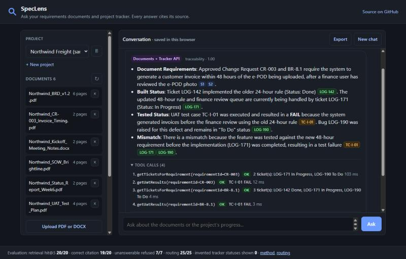
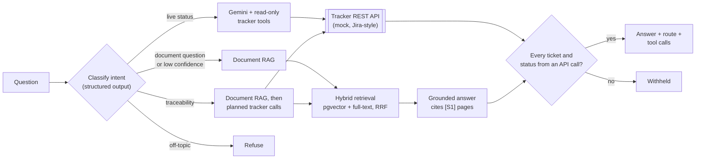
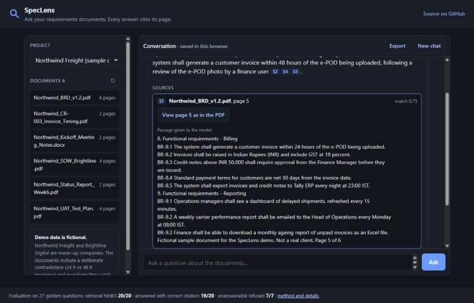

# SpecLens

**Ask your requirements documents and your project tracker. Every answer cites its source, and it says so when the answer isn't there.**

[](https://github.com/a-k-ay/speclens/actions/workflows/ci.yml)
&nbsp; **Live demo: [speclens.onrender.com](https://speclens.onrender.com)**

> The demo runs on a free tier. After about 15 idle minutes it sleeps, so the first visit can
> take around a minute to load. It's a read-only demo over six **fictional** documents and a
> fictional project tracker.

SpecLens is an agentic retrieval-augmented generation (RAG) assistant for BRDs, SOWs, change
requests, test plans and meeting notes, connected to a (mock, Jira-style) project tracker.
Ask in plain language and it works out where the answer lives:

- **Routes each question by intent:** to the documents, to the tracker's API, or to both, and refuses
  anything off-topic. The route and every API call are shown with the answer.
- **Requirements traceability:** "Is the 48-hour invoice rule from CR-3 built and tested?" combines
  what the documents agreed with what the tracker says was built and tested, and points out mismatches.
- **Answers cite document and page, or ticket.** A citation opens the exact passage or the real PDF page;
  a ticket opens its JSON in the tracker API.
- **Refuses instead of guessing**, and withholds any answer that names a ticket or status no API call returned.
- **Measured, not assumed:** golden sets for retrieval and for routing, with the misses written up.



**Why I built it.** As a business analyst I wrote BRDs and FRDs for five clients. The daily pain
was finding what a client had actually agreed to across scattered documents, catching when a later
meeting or change request had overridden the original requirement, and then checking whether what
was agreed was actually built and tested. That last step is requirements traceability. SpecLens is
the tool I wanted, and I measured whether it finds the right source instead of trusting that it does.

---

## Results

Two labelled sets, both run with the real models. Full per-question reports:
[docs/EVAL.md](docs/EVAL.md) (documents) and [docs/EVAL-ROUTING.md](docs/EVAL-ROUTING.md) (routing).

**Document retrieval and answers:** 20 answerable questions, each with the document and page that
holds the answer, and 7 the documents can't answer.

| Metric | Result |
|---|---|
| Retrieval hit@5 (the right page is in the top 5 sources) | **20/20** |
| Answered and cited an expected page | **19/20** |
| Answer contains the expected facts | **18/20** |
| Unanswerable questions refused | **7/7** |
| Valid questions wrongly refused by the similarity threshold | **0/20** |

**Intent routing and tracker answers (v2):** 25 labelled questions: document, live status,
traceability and off-topic, including traps such as "What are the UAT exit criteria?" (a
document question that mentions UAT) and a prompt-injection attempt.

| Metric | Result |
|---|---|
| Intent classified correctly | **25/25** |
| Expected tracker API calls made | **16/16** |
| Answer states the tracker facts exactly | **15/15** |
| Honest about a ticket that doesn't exist | **1/1** |
| Answers shown with an invented ticket or status | **0 of 15** |

Both sets are small and I wrote them while building the system, so treat these as evidence that
the pipeline works end to end, not as a benchmark. The misses and caveats are below.

## How it works



1. **Upload:** text is extracted page by page and split into overlapping chunks that never cross a
   page, so every citation's page number is exact. Each chunk gets an embedding and a Postgres
   full-text entry. Abbreviation definitions such as "electronic proof of delivery (e-POD)" are
   stored so they can travel with chunks that only say "e-POD".
2. **Classify:** one model call with structured output returns the intent, a confidence and any
   requirement or ticket IDs. Low confidence falls back to the document path.
3. **Act:**
   - *Documents:* vector and keyword search inside the project, merged with Reciprocal Rank Fusion;
     the model sees only the top five passages and must cite them.
   - *Live status:* the model calls read-only tracker tools (`getTicket`, `searchTickets`, ...) over
     HTTP. Every argument is validated in code before any call.
   - *Traceability:* SpecLens finds the requirement (from the question, from what a change request
     changes, or from the best-matching requirement statement), fetches its tickets and UAT results,
     and the model answers from both sources.
4. **Check before showing:** citations must point at real sources, and every ticket, test and
   status in an answer must match an API result. If the tracker is down, the answer falls back to
   the documents and says live data is unavailable.



## What measuring taught me

The evaluations and testing with the real model changed the design more than once:

- **Similarity alone can't decide when to refuse.** "How many defects were found during UAT?" is
  unanswerable from the documents but scores 0.726 against the UAT plan, higher than half the
  answerable questions. Similarity measures *topic*, not *whether the answer is present*.
  ([ADR 0006](docs/adr/0006-refusal-threshold.md))
- **Hybrid search didn't beat vector search on this corpus.** Postgres's default parser splits IDs
  like `BR-7.4` into `br` and `-7.4`. Hybrid stays as a safety net for exact terms; I didn't tune it
  against the same questions. ([ADR 0005](docs/adr/0005-hybrid-retrieval-with-rrf.md))
- **A citation shows where an answer came from, not that it's correct.** One answer cited the right
  page but said "Phase 1" where the source says "Phase 2"; only the fact check caught it.
- **Testing routing with the real model found four bugs the fake model never would:** Gemini cites
  `[S1, S2]` (grouped), which my parser dropped; a UAT page listing many requirements pulled stray
  IDs into a change-request lookup; documents stored before line breaks were kept made every
  requirement tie; and "has **not** passed UAT" was flagged as an invented PASS.
  ([ADR 0010](docs/adr/0010-classify-then-act.md))
- **A new test found a hole in the status check:** "LOG-999 is Done" (a ticket that doesn't exist)
  slipped through. An answer may now say a looked-up ticket doesn't exist, but can't give it a status.
- **The free tier is a real constraint.** Flash-Lite allows 15 requests a minute and one routed
  question makes 2 to 4. A first routing run lost a question to a rate limit, not to a wrong route;
  the larger model answers paraphrases better but allows 20 requests a day.
  ([ADR 0001](docs/adr/0001-gemini-via-spring-ai-google-genai.md))

## Design decisions

Each decision is recorded with its context, alternatives and trade-offs in [docs/adr](docs/adr/README.md):

| ADR | Decision |
|---|---|
| [0001](docs/adr/0001-gemini-via-spring-ai-google-genai.md) | Gemini through Spring AI's native Google GenAI integration; Flash-Lite vs Flash |
| [0002](docs/adr/0002-plain-jdbc-instead-of-jpa.md) | Plain SQL with `JdbcClient` instead of JPA |
| [0003](docs/adr/0003-embedding-model-and-dimensions.md) | 768-dimension embeddings, HNSW index, asymmetric query/document prefixes |
| [0004](docs/adr/0004-page-bounded-chunking.md) | Page-bounded chunks, about 1,000 characters with 150 overlap |
| [0005](docs/adr/0005-hybrid-retrieval-with-rrf.md) | Hybrid retrieval with Reciprocal Rank Fusion, and its measured result |
| [0006](docs/adr/0006-refusal-threshold.md) | Three-layer refusal; threshold 0.58 chosen from the eval data |
| [0007](docs/adr/0007-document-glossary.md) | Abbreviation glossary carried into the prompt |
| [0008](docs/adr/0008-show-the-original-page.md) | Keep the original file and show the cited PDF page |
| [0009](docs/adr/0009-chat-history-in-the-browser.md) | Chat history in the browser only; read-only public demo |
| [0010](docs/adr/0010-classify-then-act.md) | Classify the question first, then act, instead of a free-running agent |
| [0011](docs/adr/0011-mock-tracker-behind-http.md) | A mock, Jira-shaped tracker called over a real HTTP boundary |
| [0012](docs/adr/0012-read-only-tools-and-failure-handling.md) | Read-only tools, validated arguments, timeouts and graceful failure |

## Tech stack

| Area | Choice |
|---|---|
| Backend | Java 21, Spring Boot 4.1, Spring AI 2.0 |
| Models | Gemini (`gemini-3.5-flash-lite` for classification and answers, `gemini-embedding-2` for embeddings) |
| Agentic | Intent classification with structured output, Spring AI tool calling (`@Tool`), `RestClient` to the tracker |
| Data | PostgreSQL 17 + pgvector 0.8 (HNSW), Postgres full-text search, Flyway migrations |
| Documents | Apache PDFBox (text and page images), Apache POI (DOCX) |
| Tests | JUnit 5, Testcontainers (real pgvector in Docker), fake models that drive the real tool callbacks, so CI needs no API key; 146 tests |
| CI / deploy | GitHub Actions; Docker (multi-stage, sized for 512 MB); Render + Neon |
| Frontend | Plain HTML, CSS and JavaScript served by Spring Boot |

**Safety on the public demo:** read-only mode (uploads, new projects and deletions return `403`,
enforced on the server); read-only tracker tools with every argument validated before any call and
at most 6 calls per question; per-IP and daily rate limits; secrets only in environment variables;
model output HTML-escaped before display; and prompt rules to treat document and ticket text as
data, never as instructions.

## Run it locally

You need Java 21 and Docker. Maven comes with the project (`mvnw`).

```bash
cp .env.example .env            # then put your Gemini API key in .env
docker compose up -d            # Postgres 17 + pgvector on port 5433
DEMO_SEED=true ./mvnw spring-boot:run
```

Open <http://localhost:8080>. The six sample documents load on first start and the mock tracker is
served by the same app. Locally you can also upload your own files, create and delete projects, and
export conversations. `TRACKER_SIMULATE_OUTAGE=true` shows the "tracker is down" behaviour.

```bash
./mvnw verify                                  # all tests; Testcontainers and fake models, no API key needed
./mvnw test -Peval -Dtest=RetrievalEvaluation  # document golden set with real models; rewrites docs/EVAL.md
./mvnw test -Peval -Dtest=RoutingEvaluation    # routing set with real models; rewrites docs/EVAL-ROUTING.md
```

A step-by-step guide for every feature, with expected results, is in
[docs/TESTING.md](docs/TESTING.md); deployment is in [docs/DEPLOY.md](docs/DEPLOY.md).

<details>
<summary>API endpoints</summary>

| Method | Path | Purpose |
|---|---|---|
| `POST` | `/api/projects/{id}/ask` | Ask a question: `{"question": "..."}`. Returns the answer, citations, route, intent, tool calls and tracker references |
| `GET` | `/api/projects` | List projects |
| `POST` | `/api/projects` | Create a project |
| `DELETE` | `/api/projects/{id}` | Delete a project and everything in it |
| `GET` | `/api/projects/{id}/documents` | List documents |
| `POST` | `/api/projects/{id}/documents` | Upload a PDF or DOCX (multipart `file`) |
| `DELETE` | `/api/projects/{id}/documents/{documentId}` | Delete a document |
| `GET` | `/api/documents/{id}/pages/{page}/image` | A PDF page as PNG |
| `GET` | `/api/config` | Which features are enabled |
| `GET` | `/actuator/health` | Health check |

Mock tracker (Jira-shaped, read-only, fictional data):

| Method | Path | Purpose |
|---|---|---|
| `GET` | `/mock-tracker/rest/api/3/issue/{key}` | One ticket, e.g. `LOG-142` |
| `GET` | `/mock-tracker/rest/api/3/search?requirement=&status=&sprint=` | Matching tickets |
| `GET` | `/mock-tracker/rest/api/3/test-runs?requirement=` | UAT results |
| `GET` | `/mock-tracker/rest/api/3/project` | Project and current sprint |

Errors use RFC 7807 problem JSON. A Postman collection is in [docs/postman](docs/postman/SpecLens.postman_collection.json).
</details>

## Non-goals

Deliberately out of scope, with the reason:

- **Web search or outside knowledge.** The point is answers grounded in *the client's* documents
  and tracker; mixing in the web would make "not found" meaningless.
- **Write actions in the tracker.** Answering questions never needs to create or change a ticket,
  so the tools can't; even a manipulated model has nothing harmful to call.
- **Real Jira credentials.** The demo uses a mock tracker with fictional data behind a real HTTP
  boundary; the base URL and the documented query mapping make a real Jira a configuration change.
- **A free-running agent.** Classify-then-act keeps cost, latency and behaviour predictable and
  measurable ([ADR 0010](docs/adr/0010-classify-then-act.md)).
- **MCP (for now).** The tracker tools could be exposed through an MCP server; it isn't needed for
  one app calling one API.
- **User accounts and server-side history.** Without accounts, stored history would be visible to
  every visitor; history stays in the browser and can be exported instead.
- **OCR for scanned PDFs**, and **table structure extraction** (citations show the real PDF page instead).
- **Horizontal scaling.** Rate limits are in memory, which is right for one instance; several
  instances would need a shared store such as Redis.
- **Real client documents.** All sample data is fictional, and no documents from any employer or
  client are used.

## AI pairing

Built with Claude Code as an AI pair programmer. The product idea, scope, requirements and
review are mine; implementation was done in pairing sessions, and every design decision is
written up with its reasoning in [docs/adr](docs/adr/README.md).
