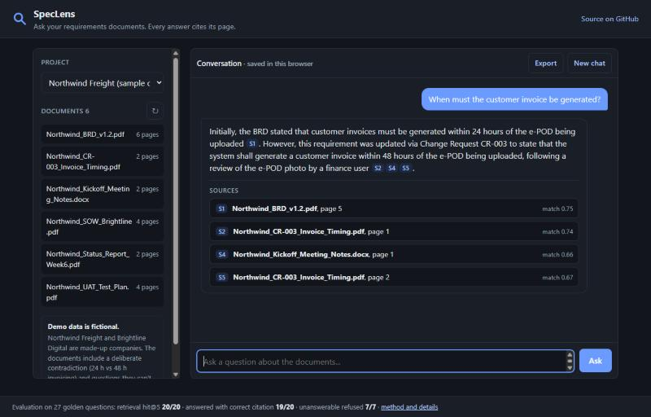
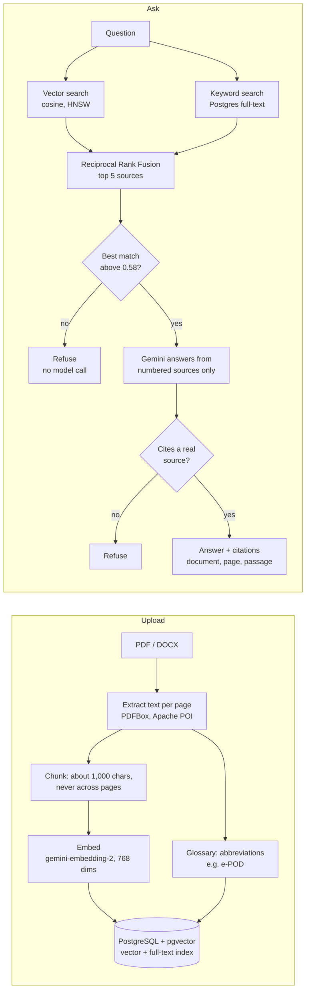

# SpecLens

**Ask your requirements documents. Every answer cites its page, and it says so when the answer isn't there.**

[](https://github.com/a-k-ay/speclens/actions/workflows/ci.yml)
&nbsp; **Live demo: [speclens.onrender.com](https://speclens.onrender.com)**

> The demo runs on a free tier. After about 15 idle minutes it sleeps, so the first visit can
> take around a minute to load. It's a read-only demo over six **fictional** documents.

SpecLens is a retrieval-augmented generation (RAG) assistant for BRDs, SOWs, change requests,
test plans and meeting notes. Upload PDF or DOCX files and ask questions in plain language:

- **Answers cite document and page**, and each citation opens the exact passage, or the real PDF page as an image.
- **Refuses instead of guessing:** "Not found in the uploaded documents." when the documents don't say.
- **Flags conflicts between documents**, e.g. the BRD says invoices within 24 hours, a later change request says 48.
- **Measured, not assumed:** a golden question set checks that it retrieves the right page and refuses what it should.



**Why I built it.** As a business analyst I wrote BRDs and FRDs for five clients. The daily pain
was finding what a client had actually agreed to across scattered documents, and catching when
a later meeting or change request had overridden the original requirement. SpecLens is the tool
I wanted, and I measured whether it finds the right source instead of trusting that it does.

---

## Results

Evaluated on a golden set of **20 answerable questions** (each with the document and page that
holds the answer) and **7 questions the documents can't answer**, using the real models.
Full report, per question: [docs/EVAL.md](docs/EVAL.md).

| Metric | Result |
|---|---|
| Retrieval hit@5 (the right page is in the top 5 sources) | **20/20** |
| Answered and cited an expected page | **19/20** |
| Answer contains the expected facts | **18/20** |
| Unanswerable questions refused | **7/7** |
| Valid questions wrongly refused by the similarity threshold | **0/20** |

The corpus is small (6 documents, 21 passages), so these numbers show the pipeline works end to
end; they are not a benchmark. The misses are documented below.

## How it works



1. **Upload:** text is extracted page by page and split into overlapping chunks that never cross a
   page, so every citation's page number is exact. Each chunk gets an embedding and a Postgres
   full-text index entry. Abbreviation definitions such as "electronic proof of delivery (e-POD)"
   are stored so they can travel with chunks that only say "e-POD".
2. **Retrieve:** every question runs a semantic (vector) search and a keyword search inside its
   project, merged with Reciprocal Rank Fusion.
3. **Refuse early:** if nothing retrieved is similar enough to the question, SpecLens refuses
   without calling the model.
4. **Answer:** the model sees only the top five passages, labelled `[S1]` to `[S5]`, and must cite
   them. The server drops citations to sources that don't exist and withholds any answer that
   cites nothing. Every refusal says which of these three safeguards fired.


## What measuring taught me

The evaluation changed the design more than once. The honest findings:

- **Similarity alone can't decide when to refuse.** "How many defects were found during UAT?" is
  unanswerable (UAT hasn't started) but scores 0.726 against the UAT plan, higher than half the
  answerable questions. Similarity measures *topic*, not *whether the answer is present*. So the
  threshold only stops clearly off-topic questions, and the model and a citation check do the
  rest. ([ADR 0006](docs/adr/0006-refusal-threshold.md))
- **Hybrid search didn't beat vector search on this corpus.** Vector search alone found every
  expected page. One reason: Postgres's default parser splits IDs like `BR-7.4` into `br` and
  `-7.4`, weakening keyword matches on requirement IDs. Hybrid stays as a safety net for exact
  terms; I didn't tune it against the same 20 questions. ([ADR 0005](docs/adr/0005-hybrid-retrieval-with-rrf.md))
- **Model size matters for paraphrases.** The lightweight model refused "How soon after
  *delivery* must an invoice be generated?" when the document says "after the *e-POD is
  uploaded*". The larger model answers it but allows only 20 free requests a day, so the demo
  uses the lightweight one and this question stays in the eval as a known hard case.
  ([ADR 0001](docs/adr/0001-gemini-via-spring-ai-google-genai.md))
- **A citation shows where an answer came from, not that it's correct.** One answer cited the
  right page but said "Phase 1" where the source says "Phase 2". The eval's fact check caught it.
- **Chunks lose context.** Definitions live on one page and get used on others, hence the
  document glossary. ([ADR 0007](docs/adr/0007-document-glossary.md))

## Design decisions

Each decision is recorded with its context, alternatives and trade-offs in [docs/adr](docs/adr/README.md):

| ADR | Decision |
|---|---|
| [0001](docs/adr/0001-gemini-via-spring-ai-google-genai.md) | Gemini through Spring AI's native Google GenAI integration; Flash-Lite vs Flash |
| [0002](docs/adr/0002-plain-jdbc-instead-of-jpa.md) | Plain SQL with `JdbcClient` instead of JPA |
| [0003](docs/adr/0003-embedding-model-and-dimensions.md) | 768-dimension embeddings, HNSW index, asymmetric query/document prefixes |
| [0004](docs/adr/0004-page-bounded-chunking.md) | Page-bounded chunks, about 1,000 characters with 150 overlap |
| [0005](docs/adr/0005-hybrid-retrieval-with-rrf.md) | Hybrid retrieval with Reciprocal Rank Fusion, and its measured result |
| [0006](docs/adr/0006-refusal-threshold.md) | Three-layer refusal; threshold 0.58 chosen from the eval data |
| [0007](docs/adr/0007-document-glossary.md) | Abbreviation glossary carried into the prompt |
| [0008](docs/adr/0008-show-the-original-page.md) | Keep the original file and show the cited PDF page |
| [0009](docs/adr/0009-chat-history-in-the-browser.md) | Chat history in the browser only; read-only public demo |

## Tech stack

| Area | Choice |
|---|---|
| Backend | Java 21, Spring Boot 4.1, Spring AI 2.0 |
| Models | Gemini (`gemini-3.5-flash-lite` for answers, `gemini-embedding-2` for embeddings) |
| Data | PostgreSQL 17 + pgvector 0.8 (HNSW), Postgres full-text search, Flyway migrations |
| Documents | Apache PDFBox (text and page images), Apache POI (DOCX) |
| Tests | JUnit 5, Testcontainers (real pgvector in Docker), fake models so CI needs no API key; 63 tests |
| CI / deploy | GitHub Actions; Docker (multi-stage, sized for 512 MB); Render + Neon |
| Frontend | Plain HTML, CSS and JavaScript served by Spring Boot |

**Safety on the public demo:** read-only mode (uploads, new projects and deletions return `403`,
enforced on the server), per-IP and daily rate limits, secrets only in environment variables,
model output HTML-escaped before display, and a prompt rule to ignore instructions inside
document text.

## Run it locally

You need Java 21 and Docker. Maven comes with the project (`mvnw`).

```bash
cp .env.example .env            # then put your Gemini API key in .env
docker compose up -d            # Postgres 17 + pgvector on port 5433
DEMO_SEED=true ./mvnw spring-boot:run
```

Open <http://localhost:8080>. The six sample documents load on first start. Locally you can also
upload your own files, create and delete projects, and export conversations.

```bash
./mvnw verify                   # all tests; uses Testcontainers and fake models, no API key needed
./mvnw test -Peval              # the golden-set evaluation with real models; rewrites docs/EVAL.md
```

A step-by-step guide for every feature, with expected results, is in
[docs/TESTING.md](docs/TESTING.md); deployment is in [docs/DEPLOY.md](docs/DEPLOY.md).

<details>
<summary>API endpoints</summary>

| Method | Path | Purpose |
|---|---|---|
| `GET` | `/api/projects` | List projects |
| `POST` | `/api/projects` | Create a project |
| `DELETE` | `/api/projects/{id}` | Delete a project and everything in it |
| `GET` | `/api/projects/{id}/documents` | List documents |
| `POST` | `/api/projects/{id}/documents` | Upload a PDF or DOCX (multipart `file`) |
| `DELETE` | `/api/projects/{id}/documents/{documentId}` | Delete a document |
| `POST` | `/api/projects/{id}/ask` | Ask a question: `{"question": "..."}` |
| `GET` | `/api/documents/{id}/pages/{page}/image` | A PDF page as PNG |
| `GET` | `/api/config` | Which features are enabled |
| `GET` | `/actuator/health` | Health check |

Errors use RFC 7807 problem JSON. A Postman collection is in [docs/postman](docs/postman/SpecLens.postman_collection.json).
</details>

## Non-goals

Deliberately out of scope, with the reason:

- **Web search or outside knowledge.** The point is answers grounded in *the client's* documents;
  mixing in the web would make "not found in the documents" meaningless.
- **User accounts and server-side history.** Without accounts, stored history would be visible to
  every visitor; history stays in the browser and can be exported instead.
- **OCR for scanned PDFs.** Image-only PDFs are rejected with a clear message.
- **Table structure extraction.** Citations show the real PDF page instead; detecting tables in
  PDFs reliably is a project of its own.
- **Horizontal scaling.** Rate limits are in memory, which is right for one instance; several
  instances would need a shared store such as Redis.
- **Real client documents.** All sample data is fictional, and no documents from any employer or
  client are used.

## AI pairing

Built with Claude Code as an AI pair programmer. The product idea, scope, requirements and
review are mine; implementation was done in pairing sessions, and every design decision is
written up with its reasoning in [docs/adr](docs/adr/README.md).
